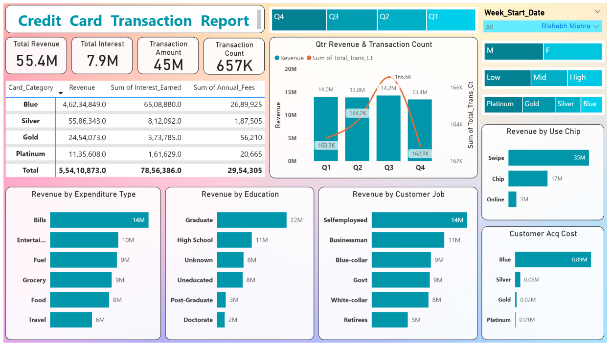

# Goal
The objective of these Power BI reports is to provide actionable insights into credit card customer behavior and transaction patterns. These dashboards are designed to help financial institutions make informed decisions about customer segmentation, spending habits, and overall business performance.

# 🖥️ Screenshots

### Customer Report Dashboard

### Transactio Report Dashboard

# Objectives
1. Analyze Revenue Trends:
* Visualize revenue by different segments such as income group, expenditure type, age group, and education level.
* Identify high-revenue generating categories and customer profiles.
  
2. Understand Transaction Dynamics:
* Display transaction counts across various categories like card types and transaction modes.
* Highlight quarterly revenue and transaction count trends.
  
3. Customer Segmentation Insights:
* Break down data by demographic groups (e.g., marital status, education, and job type).
* Analyze customer behavior based on card acquisition types and geographic regions.
  
4. Optimize Business Strategy:
* Identify opportunities to increase revenue and improve customer satisfaction.
* Target specific customer groups for marketing and product development.
  
# Results

1. Key Revenue Drivers:
* High-income customers and post-graduate education holders contribute significantly to revenue.
* Travel and bills dominate expenditure categories.
  
2. Transaction Patterns:
* Swipe transactions are the most used payment method.
* Blue card category customers account for the highest revenue and transaction counts.
  
3. Demographic Insights:
* Married customers and customers aged 60+ are high-value groups.
* States like Texas, New York, and California are top revenue contributors.
  
4. Quarterly Trends:
* Consistent growth in revenue and transaction counts across all quarters, with Q4 showing the highest figures.

1. Top Performing Segments:

i). Card Categories:
* Blue card: Revenue $47M.

ii). Demographics:
* Age group 60+: $14M.

iii). Expenditure Type:
* Bills and Entertainment contribute the highest revenue at $14M and $10M, respectively.
  
2. Geographical Insights:
Top Revenue States:
Texas: $7.3M, New York: $6.2M, California: $6.7M.

3. Spending Trends by Education:
* Post-graduate holders account for $13M, followed by Graduates at $10M.
