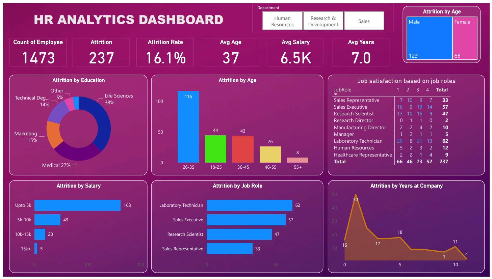

# Goal

The HR Analytics Dashboard aims to provide a comprehensive analysis of human resource data to help organizations make data-driven decisions. The dashboard offers insights into employee demographics, performance, attrition rates, and other key HR metrics.

### HR Analytics Dashboard

# Objective

Help an organization to improve employee performance and improve employee retention (reduce attrition) by creating an Amazing HR Analytics dashboard.

1. Employee Demographics:
* Analyze the distribution of employees by age, gender, department, and job role.
* Identify diversity metrics and trends within the organization.

2. Performance Analysis:
* Monitor employee performance across different departments and job roles.
* Identify top performers and areas needing improvement.
  
3. Attrition and Retention:
* Track attrition rates and identify key factors contributing to employee turnover.
* Analyze retention rates and the effectiveness of retention strategies.

4. HR Metrics and KPIs:
* Measure key HR metrics such as average tenure, promotion rates, and training completion rates.
* Provide actionable insights to improve HR policies and practices.

# Results

1. Demographic Insights:
* Gender distribution: 45% female, 55% male.
* Age distribution: Majority of employees are in the 30-40 age group.
* Department with the highest number of employees: Sales.

2. Performance Insights:
* Top performing departments: IT and Sales.
* Employees with highest performance ratings are predominantly in managerial roles.

3. Attrition Insights:
* Annual attrition rate: 12%.
* Key reasons for attrition: Lack of career progression and inadequate compensation.

4. HR Metrics:
* Average employee tenure: 3.5 years.
* Promotion rate: 15% annually.
* Training completion rate: 85%.

# Learnings

* Identifyed key factors to reduce attrition
* Improved the hiring process
* Improved employee experience
* Made workforce more productive
* Gained employee trust
