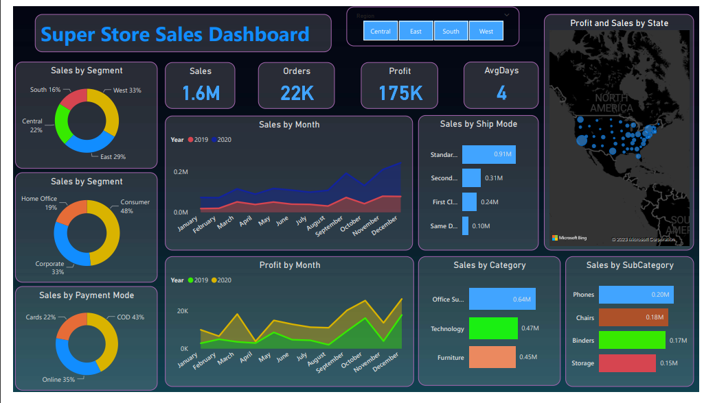
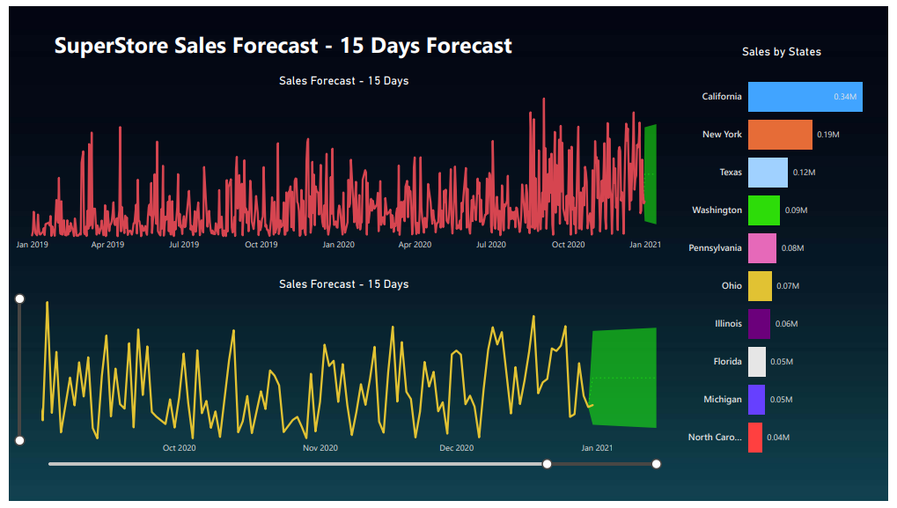

# Sales-Dashboard-PowerBI
This project involves creating a dynamic and interactive **Sales Dashboard** using **Power BI** to visualize and analyze sales performance, trends, and insights effectively. For more details, read this `README.md`.

## 🚀 Goal
The primary goal of this project is to develop an interactive **Sales Dashboard** that provides actionable insights into sales performance, helping stakeholders make data-driven decisions.

## 🎯 Objectives
- Visualize sales performance across multiple dimensions, including categories, regions, and customer segments.
- Provide insights into profit trends, payment modes, and shipment preferences.
- Implement forecasting to predict future sales trends for effective planning.
- Create a user-friendly dashboard with drill-down capabilities for detailed analysis.

## 📝 Description
* The **Sales Dashboard** is designed to showcase sales performance using key metrics such as **Total Sales**, **Profit**, **Orders**, and **Delivery Time**. 
* It includes visualizations for sales by category, subcategory, region, customer segment, and shipping modes.
* A **15-day sales forecast** has been integrated to provide predictive insights, enabling proactive decision-making.
* The dashboard was built entirely in **Power BI**, leveraging advanced DAX functions for calculations and KPI creation.

## 📸 **Screenshots**
### Overview of Sales Performance

### Regional Sales Insights

## 🌟 Key Features:
- **Interactive Visualizations:** Dynamic charts and slicers for in-depth analysis.
- **Sales Forecasting:** A 15-day predictive sales trend to aid planning.
- **Profit Analysis:** Month-wise breakdown to track profitability.
- **Regional Insights:** Sales and profit distribution across different regions.
- **Customer Segmentation:** Analysis of sales by consumer, corporate, and home office segments.

## 🌟 Results
The dashboard provides a holistic view of sales performance, enabling better decision-making and strategic planning. With its intuitive design and actionable insights, it serves as a valuable tool for stakeholders.

## 💡 Why This Project?
This project was undertaken to demonstrate the power of **Power BI** in transforming raw data into meaningful insights. The sales domain is highly dynamic, and effective visualization can greatly aid in making informed decisions. This project helped me enhance my data visualization, DAX, and dashboard design skills.

## 🛠️ Technologies Used
- **Data Visualization Tool:** Power BI
- **Data Preparation:** Power Query and DAX
- **Data Source:** Simulated sales dataset
- **Design:** Interactive and visually appealing dashboards with slicers and drill-down options.

## Developer Information
* **Developer Name:** Mohd Sameer Hussain
* **Email:** mohdsameerhussain28@gmail.com
* **LinkedIn:** [Mohd Sameer Hussain](https://www.linkedin.com/in/mohdsameer28)
* **GitHub:** [SameerHussain128](https://github.com/SameerHussain128)
